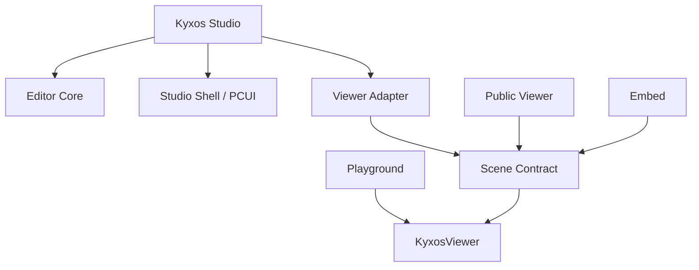
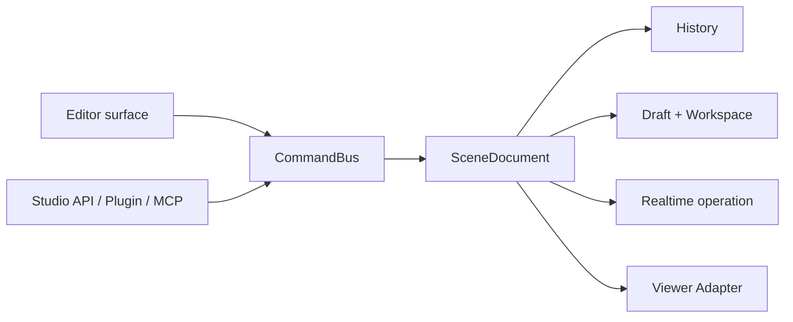

# Kyxos Architecture

## Products

`@kyxos/viewer` is the only rendering runtime. It may use Three.js WebGPURenderer, TSL, RenderPipeline and official effect nodes, but it cannot import Studio, backend, authentication, PCUI or publishing code.

Studio cannot import Three.js. Every viewport change crosses `KyxosViewportAdapter`; every data change crosses `CommandBus → SceneDocument → JSON Patch → History → Autosave → Viewer Adapter`.

Public Viewer is read-only and cannot import Editor Core, Studio Shell, PCUI, Observer, upload or draft APIs. Playground, Studio, Public Viewer and Embed are separate application entry graphs and cannot import one another. `scripts/verify-boundaries.mjs` enforces these rules and `scripts/build-pages.mjs` scans each production bundle.

## Persistence

The production reference backend is Supabase Auth, PostgreSQL, private Storage, private Realtime channels and Edge Functions. Project-scoped Owner, Editor and Viewer roles are enforced twice: Studio disables disallowed actions, while PostgreSQL RLS remains authoritative for projects, drafts, workspaces, scenes, templates, source files, presence, operations, branches, checkpoints and conflicts. Private `project:<uuid>` Realtime topics authorize Broadcast writes for Owner/Editor and Presence for every member. `published_versions` and `published_assets` reject UPDATE and DELETE through triggers. Public resolution returns only an immutable snapshot, its published asset manifest and the configured Embed origins.

When Supabase environment variables are absent, GitHub Pages uses a local provider: project metadata, roles, workspaces, operations, branches, checkpoints and releases are stored in localStorage, while binary assets remain in IndexedDB. BroadcastChannel provides same-origin local collaboration. This provider is an acceptance environment, not a replacement for production RLS or private Supabase Realtime authorization.

## Editor state flow

Hierarchy, Inspector, Assets, templates, the animation graph, Studio API, plugins and MCP all write through the same command boundary:

## Upgrade boundaries

- Viewer API version and Scene Contract version are independent.
- Studio generates controls from `viewer.getCapabilities()`.
- Public Viewer migrates supported older contracts before loading.
- Published snapshots are never edited in place.
- New Viewer releases must pass old-contract fixtures and fixed-version tests.

## Source provenance

PlayCanvas Editor commit `3446b0a1b7ac95912771f1431a10f804f62e814f` is the audited interaction reference. PCUI and Observer are contained in `@kyxos/studio-shell`; PlayCanvas Engine, Entity, Components, GraphicsDevice, ShareDB, Realtime and hosted services are excluded. See `THIRD_PARTY_NOTICES.md` and `third-party/playcanvas-editor-source.json`.
